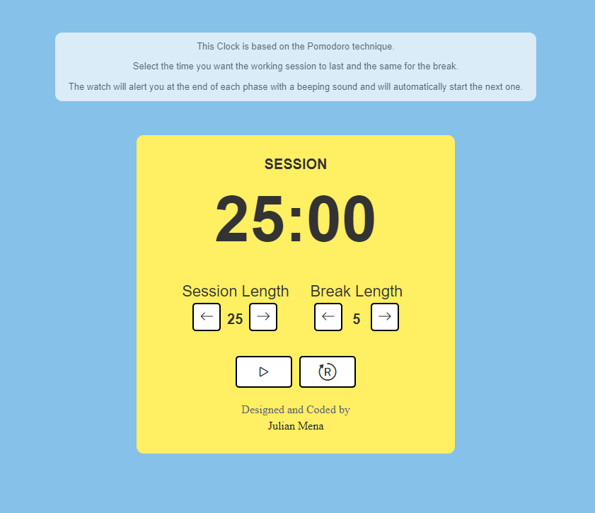

# react-pomodoro-clock
React project using React Hooks in Functional Components.

The application consists of a timer clock to study or work more efficiently as it schedules work and break periods.

## Online Demo
You can try it online with this working demo: [Pulse aqui](https://julianmenav.github.io/react-pomodoro-clock/)

## Run
To use the app, clone the repository locally.

Install dependencies:
```
npm i
```
Run locally:
```
npm start
```
## Deployment
Generate build:
```
npm run build
```
Deployment in static server:
```
npm install -g serve
serve -s build
```
## Demo image

